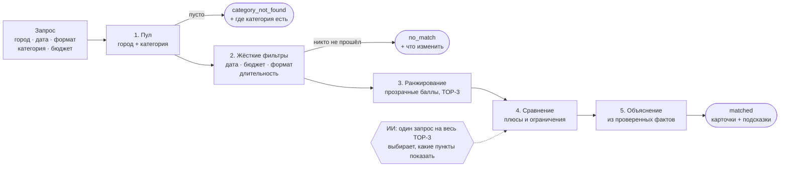

# ASA — умный подбор event-подрядчиков


Заказчик уже выбрал тип мероприятия и получил каталог по своему городу. ASA помогает **выбрать из этого списка**, а не удлинить его: проверяет дату, формат и бюджет, оставляет до трёх подрядчиков и для каждого показывает **плюсы и ограничения по сравнению с остальными**. Если подходящих мало или нет совсем, сервис объясняет почему и подсказывает, что изменить в запросе.


## Содержание

- [Быстрый старт](#быстрый-старт)
- [Как это работает](#как-это-работает)
- [Сравнение карточек](#сравнение-карточек)
- [Три исхода](#три-исхода)
- [Демо-сценарии](#демо-сценарии)
- [ИИ в пайплайне](#ии-в-пайплайне)
- [Проверка Definition of Done](#проверка-definition-of-done)
- [Структура проекта](#структура-проекта)
- [Программный интерфейс](#программный-интерфейс)
- [Данные](#данные)

## Быстрый старт

Нужен Python 3.10 или новее.

```powershell
git clone https://github.com/BAITC-Hacks/hack-d5f21cdd-asa.git
cd hack-d5f21cdd-asa
python -m pip install -r requirements.txt
python -m streamlit run app.py
```

Откроется `http://localhost:8501`. Выберите **«Быстрый сценарий»** или заполните форму и нажмите **«Найти TOP‑3»**.

> Если Windows отвечает, что команда `python` не найдена, используйте `py` вместо `python`.

| Команда | Что делает |
|---|---|
| `python -m streamlit run app.py` | веб-интерфейс |
| `python demo.py` | все демо-сценарии и имитация сбоя ИИ в терминале |
| `python -m unittest` | 27 тестов: подбор, сравнение, объяснения и сквозные проверки DoD |

Ядро (`matching.py`, `comparison.py`, `explanations.py`, `service.py`) работает на стандартной библиотеке Python, без внешних зависимостей. Streamlit нужен только для интерфейса, оформление лежит в `styles.css`.

## Как это работает



| Шаг | Модуль | Что происходит |
|---|---|---|
| **1. Пул** | `matching.py` | Подрядчики нужного города, у которых среди категорий есть запрошенная. Площадки лежат в том же каталоге: профиль «Банкетный зал \| Отель \| Ресторан» находится по запросу «Банкетный зал». |
| **2. Фильтры** | `matching.py` | Кандидат исключается, если занят на дату, его цена «от» выше бюджета, он не берёт этот формат или работает на площадке меньше запрошенного. Для каждого отсеянного запоминается, какие именно условия он не прошёл: из этого строятся подсказки. |
| **3. Ранжирование** | `matching.py` | Прошедшие фильтры получают баллы (таблица ниже). При равенстве сортировка идёт по `id`, поэтому одинаковый запрос всегда даёт одинаковый порядок. |
| **4. Сравнение** | `comparison.py` | Для каждой карточки из данных каталога собираются плюсы и ограничения **относительно других карточек выдачи**. ИИ, если подключён, выбирает, какие из них показать. |
| **5. Объяснение** | `explanations.py` | Короткий текст из тех же проверенных фактов: главное отличие, формат, свободная дата, цена в рамках бюджета, цитата из профиля. |

### Как считаются баллы

Каждый, кто прошёл фильтры, получает базу **70**. Сверху добавляются компоненты `score_parts`, их видно в режиме «Подробности подбора».

| Компонента | Баллы | Когда начисляется |
|---|:---:|---|
| Позиция формата | 10 / 6 / 2 / 0 | запрошенный формат стоит в профиле первым, вторым, третьим… |
| Описание про этот вид событий | 0–10 | в тексте профиля есть «свадеб», «невест», «форум», «юбиле»… (+5 за каждое совпадение) |
| Язык | 0 / 5 | совпал выбранный язык (язык — сигнал ранжирования, не фильтр) |
| Длительность | 0 / 5 | длительность подтверждена данными `max_hours` |

> **Цена баллов не добавляет.** Дешевле не значит лучше: бюджет работает только как фильтр.

## Сравнение карточек

Каждая карточка в коротком списке состоит из профиля, колонок **«Плюсы»** и **«Что учесть»**, короткого объяснения и строки об источнике сравнения. Все пункты считаются из полей каталога и сравнивают карточку с остальными в выдаче, поэтому, даже если стереть имена, карточки нельзя перепутать.

| Пункт | Тип | Пример | Откуда |
|---|:---:|---|---|
| Самая низкая цена | плюс | «Самая низкая цена среди показанных: от 400 000 ₸» | `price_from_kzt` всех карточек |
| Цена ниже самой дорогой | плюс | «Цена от 900 000 ₸ на 100 000 ₸ ниже самого дорогого варианта» | `price_from_kzt` |
| Цена выше минимальной | ограничение | «Цена от 1 000 000 ₸ на 100 000 ₸ выше минимальной среди показанных» | `price_from_kzt` |
| Уникальный язык | плюс | «Язык «английский» указан только у этого профиля среди показанных» | `languages` |
| Самый длинный лимит часов | плюс | «Самый высокий указанный лимит среди сравнимых профилей: 12 ч» | `max_hours` |
| Лимит меньше максимума | ограничение | «Лимит 10 ч на 2 ч меньше максимума среди показанных с лимитом» | `max_hours` |
| Цитата из профиля | плюс | «В описании профиля: «…более 1000 реализованных съёмок»» | `description`, дословно |
| Качество данных | ограничение | «Цена в каталоге оценочная», «Профиль создан для демонстрации» | `price_imputed`, `city_imputed`, `synthetic` |

Пометки о качестве данных показываются всегда: ИИ не может их скрыть. Если в выдаче одна карточка, сравнивать не с кем, и в плюсах показываются подтверждённые проверки: формат, свободная дата, бюджет.

<table>
  <tr>
    <td width="50%"><b>Подробности подбора:</b> как получен балл и какие факты использованы<br></td>
    <td width="50%"><b>Одна карточка:</b> декабрь, почти все ведущие заняты<br></td>
  </tr>
</table>

## Три исхода

У каждого исхода свой цвет и заголовок. Под заголовком выводятся подсказки: **что конкретно изменить, чтобы вариантов стало больше**. Подсказка по одному условию учитывает только тех, кто не прошёл **лишь по нему**. Поэтому она честная: если изменить только это условие, названные подрядчики действительно появятся.

| Исход | Заголовок в интерфейсе | Когда | Пример подсказки |
|---|---|---|---|
| `matched` | «Подходящие подрядчики» | есть хотя бы один подходящий | «4 подрядчика подходят по всем условиям, кроме даты: 19 декабря у них занято. Ближайшие свободные дни: 20 декабря (Сон Гоку, Эмилия), 21 декабря (Хаул)…» |
| `no_match` | «Пока нет подходящих вариантов» | кандидаты есть, но никто не прошёл | «5 подрядчиков подходят по всем условиям, кроме бюджета. Увеличьте бюджет на 150 000 ₸ (до 650 000 ₸) — добавится Мицури Канроджи.» |
| `category_not_found` | «В этом городе нет такой категории» | в городе нет такой категории | «Эта категория есть в другом городе: Алматы (5 подрядчиков). Выберите его, если мероприятие можно провести там.» |

<table>
  <tr>
    <td width="50%"><b>no_match:</b> все банкетные залы заняты 6 декабря<br></td>
    <td width="50%"><b>category_not_found:</b> лайв-бэнда нет в Астане<br></td>
  </tr>
</table>

## Демо-сценарии

Все сценарии проверены на реальном каталоге (`demo_scenarios.py`, тест `test_integration.py`) и есть в форме в списке «Быстрый сценарий». Любой сценарий открывается по ссылке, например `http://localhost:8501/?scenario=2`. Если добавить `&debug=1`, включатся подробности подбора.

| # | Запрос | Карточек | Что показывает |
|:---:|---|:---:|---|
| 1 | Ведущий · Алматы · свадьба · 15.10 · 1 000 000 ₸ | 3 | плотная категория: разные баллы, разные плюсы и ограничения |
| 2 | то же, **19.12** | 1 | другая дата — другая выдача, в подсказке видно, что дело в занятости |
| 3 | Фотограф · корпоратив · 15.10 · 600 000 ₸ | 2 | сравнение по цене и лимиту часов |
| 4 | Банкетный зал · свадьба · 14.11 · 3 500 000 ₸ | 2 | площадки в том же каталоге, демо-профиль помечен |
| 5 | Флорист · свадьба · 18.10 · 300 000 ₸ | 1 | редкая категория |
| 6 | Флорист · свадьба · **17.10** · 300 000 ₸ | 1 | соседняя дата даёт другого флориста |
| 7 | Банкетный зал · свадьба · 06.12 · 10 000 000 ₸ | 0 | `no_match`: сезон, все заняты, названы ближайшие свободные дни |
| 8 | Флорист · Астана · той · 14.10 | 0 | `no_match`: единственный кандидат не берёт этот формат |
| 9 | Лайв-бэнд · Астана · той · 14.10 | 0 | `category_not_found`: подсказан другой город |

**Порядок показа жюри:** 1 → 2 (занятость меняет выдачу) → 5 (редкая категория) → 7 (пусто, но с подсказкой) → 9 (нет категории) → снова 1 с переключателем «Имитировать сбой ИИ» в «Настройках демонстрации».

## ИИ в пайплайне

ИИ **не выбирает подрядчиков, не меняет порядок и не пишет текст**. Это делает детерминированный код. Модель получает весь TOP‑3 **одним запросом** и для каждой карточки выбирает 1–2 плюса и до 2 ограничений из заранее подготовленных пунктов. Возвращает она только их `id`, а текст пунктов берётся из каталога. Поэтому модель не может выдумать цену, дату или заслугу.

| Ситуация | Что происходит | Подпись в карточке |
|---|---|---|
| Ключ задан, ответ прошёл проверку | показываются пункты, выбранные моделью | «ИИ сравнил варианты · по проверенным фактам» |
| Ключа нет | первые пункты по локальным правилам | «Сравнение по данным каталога» |
| Таймаут (6 с), ошибка API, битый JSON, неизвестный `id`, пропущенная карточка | та же выдача с локальным сравнением, поиск не ломается | «Сравнение по данным каталога» |
| В выдаче одна карточка | ИИ не вызывается, сравнивать не с кем | «Единственный подходящий вариант» |

Подключение:

```powershell
$env:OPENAI_API_KEY = "ваш_ключ"
python -m streamlit run app.py
```

Модель задаётся через `OPENAI_MODEL` (по умолчанию `gpt-4o-mini`), используется OpenAI Responses API со строгой JSON-схемой. Ключ хранится только в переменной окружения, в коде и репозитории его нет.

## Проверка Definition of Done

| Требование | Как проверяется |
|---|---|
| Ответ до 10 секунд | `test_response_time`; без ИИ ответ занимает единицы миллисекунд, запрос к модели ограничен 6 с |
| Объяснения не взаимозаменяемы | `test_explanations_are_not_interchangeable`: имена стираются, тексты должны остаться разными |
| Тот же запрос даёт тот же порядок | `test_same_request_same_order`, `test_three_outcomes_and_stable_order_without_cheapest_bonus` |
| Другая дата даёт другую выдачу, видна занятость | `test_two_dates_differ_and_message_names_busy_date`, `test_real_calendar_changes_availability` |
| Занятые, дорогие и не берущие формат не попадают в выдачу | `test_hard_constraints_never_violated`, `test_hard_filters_and_rejection_counts` |
| Плотная, редкая категория и пустой результат | `test_demo_scenarios_give_expected_outcome` |
| Пустой результат объяснён словами | `test_empty_results_are_explained_in_words` |
| ИИ получает весь TOP‑3 одним запросом | `test_one_comparison_call_for_whole_answer`, `test_responses_api_payload_is_one_structured_request` |
| ИИ показывает только проверенные пункты | `test_model_sees_all_cards_and_only_verified_points_are_shown`, `test_invalid_model_ids_use_grounded_fallback` |
| Сбой ИИ не ломает выдачу | `test_llm_outage_falls_back_without_losing_reasons`, `test_valid_model_selection_and_invalid_fallback` |
| Цитаты взяты из профиля дословно | `test_reason_quotes_come_from_profile` |
| Некорректный запрос и пустой каталог | `test_request_validation`, `test_empty_csv_and_missing_fields` |

## Структура проекта

```
├── app.py                 веб-интерфейс (Streamlit)
├── styles.css             оформление интерфейса
├── service.py             единая точка входа: run(request)
├── matching.py            загрузка CSV, фильтры, баллы, факты, заголовок и подсказки
├── comparison.py          плюсы и ограничения между карточками, выбор пунктов ИИ
├── explanations.py        короткое объяснение из проверенных фактов
├── demo_scenarios.py      демо-запросы, проверенные на каталоге
├── demo.py                прогон сценариев в терминале
├── test.py                модульные тесты
├── test_integration.py    сквозные проверки Definition of Done
├── data/providers.csv     каталог: 66 профилей
└── docs/screenshots/      скриншоты для README
```

## Программный интерфейс

```python
from service import run

response = run({
    "city": "Алматы",
    "date": "2026-10-15",          # ГГГГ-ММ-ДД, окно 23.09–31.12.2026
    "event_format": "корпоратив",  # свадьба · той · корпоратив · конференция · юбилей · день рождения
    "category": "Фотограф",
    "budget_kzt": 600_000,         # целое ≥ 0
    # необязательно: "duration_hours": 6, "language": "казахский"
})
```

| Поле ответа | Описание |
|---|---|
| `status` | `matched` · `no_match` · `category_not_found` |
| `headline` | одна фраза с итогом |
| `hints` | подсказки: почему вариантов мало и что изменить |
| `message` | `headline` и `hints` одной строкой |
| `counts` | сколько отсеяно по каждой причине; один подрядчик может попасть в несколько счётчиков |
| `results[]` | до трёх карточек: профиль, `score`, `score_parts`, `facts`, `comparison` (`pros`, `cons`), `comparison_source`, `reason`, `reason_source`, `evidence_ids` |
| `elapsed_ms` | время подбора |

<details>
<summary><b>Пример ответа</b> (сценарий 3, первая карточка, сокращённо)</summary>

```json
{
  "status": "matched",
  "headline": "Подходят 2 из 8 подрядчиков категории «Фотограф» в городе Алматы на 15 октября.",
  "hints": [
    "2 подрядчика подходят по всем условиям, кроме даты: 15 октября у них занято. Ближайшие свободные дни: 16 октября (Шикамару Нара, Леорио Паради)."
  ],
  "results": [
    {
      "id": "HK-35913",
      "name": "Тохру",
      "price_from_kzt": 400000,
      "price_imputed": true,
      "synthetic": false,
      "score": 90,
      "score_parts": {"specialization": 10, "description": 10, "language": 0, "duration": 0},
      "comparison": {
        "pros": [
          {"id": "price_lowest", "text": "Самая низкая цена среди показанных: от 400 000 ₸ (по ценам «от» в каталоге; часть цен оценочная)"},
          {"id": "profile", "text": "В описании профиля: «Тохру — ивент-фотограф с более чем 10-летним опытом и более 1000 реализованных съёмок»"}
        ],
        "cons": [
          {"id": "hours_shorter", "text": "Лимит 10 ч на 2 ч меньше максимума среди показанных с лимитом"},
          {"id": "price_estimated", "text": "Цена в каталоге оценочная: её добавили при подготовке данных"}
        ]
      },
      "comparison_source": "fallback",
      "reason": "Самая низкая цена среди показанных: от 400 000 ₸ …; в описании профиля: «…». Берёт корпоративы; дата 15 октября 2026 года в календаре свободна; оценочная цена от 400 000 ₸ укладывается в бюджет 600 000 ₸.",
      "reason_source": "fallback"
    }
  ]
}
```

</details>

Некорректный запрос (дата вне окна, отрицательный бюджет и т. п.) вызывает `ValueError` с понятным текстом на русском; интерфейс показывает его как подсказку.

## Данные

`data/providers.csv`: 66 анонимизированных профилей (Алматы — 50, Астана — 15, Зарубежье — 1), календарь занятости с 23.09 по 31.12.2026. Многозначные поля разделены `|`.

| Флаг | Сколько | Как показываем |
|---|:---:|---|
| `synthetic` | 13 | метка «демо-профиль» и пункт «Профиль создан для демонстрации» в «Что учесть» |
| `price_imputed` | 18 | метка «оценочная цена», пункт в «Что учесть», в тексте «оценочная цена от…» |
| `city_imputed` | 8 | метка «город добавлен» и пункт в «Что учесть» |

`price_from_kzt` — нижняя граница цены, поэтому везде пишем «цена от … укладывается в бюджет», а не «стоит». Пустой `max_hours` (флористы, декор, сувениры) длительность не ограничивает.
