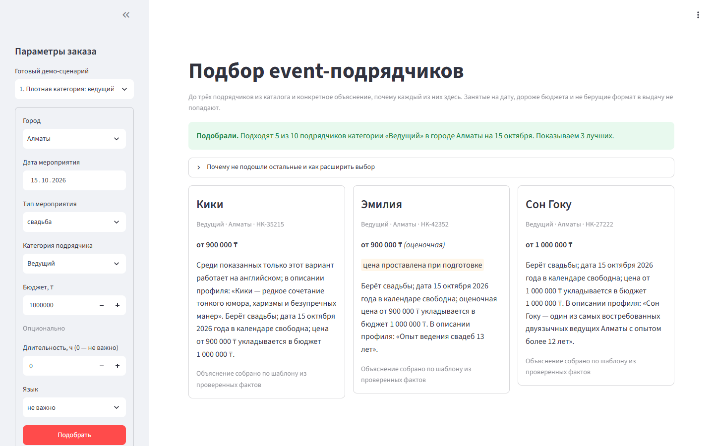
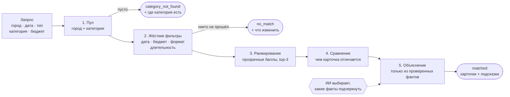
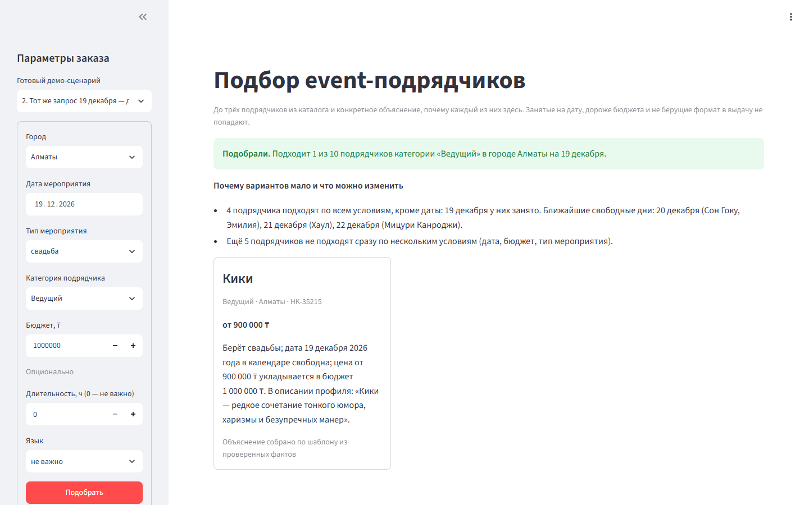
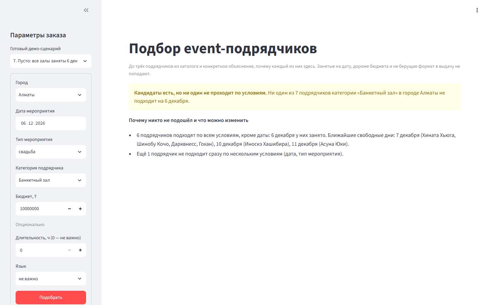
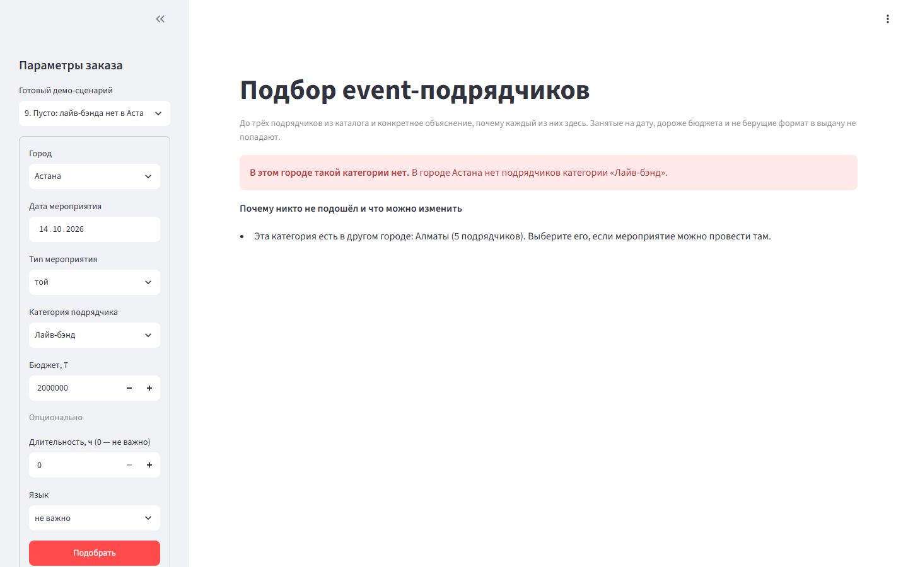
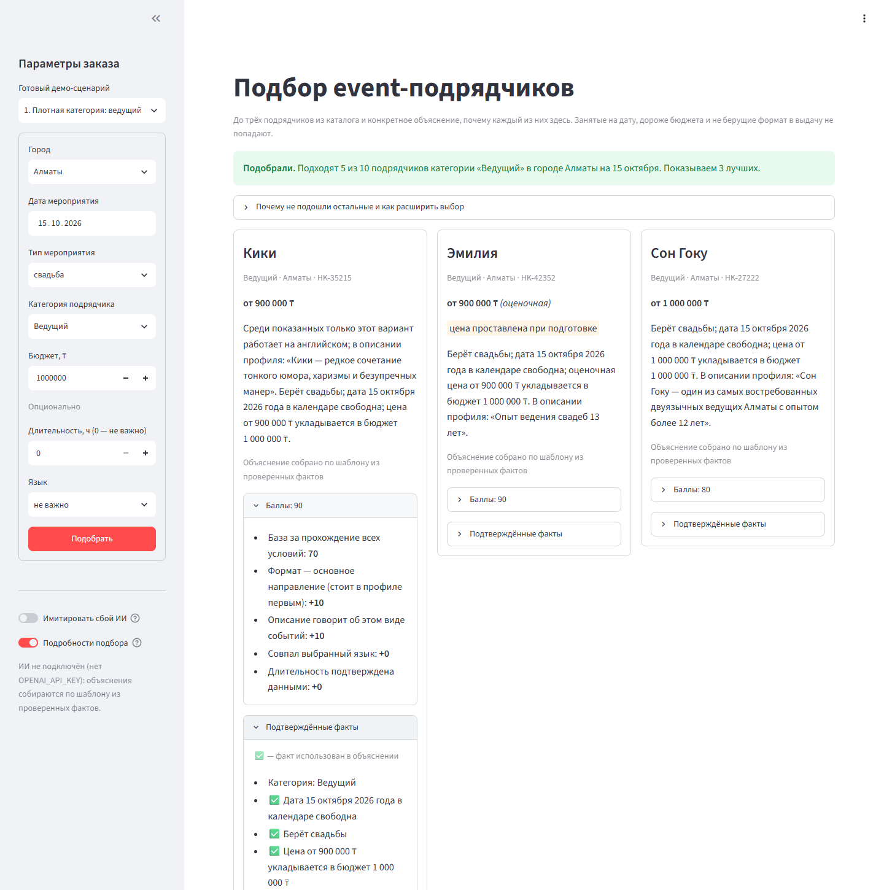

# Умный подбор event-подрядчиков


Заказчик уже выбрал тип мероприятия и получил каталог по своему городу. Сервис помогает **выбрать из этого списка**: возвращает до трёх подрядчиков и для каждого объясняет, **почему он здесь и чем отличается от соседних карточек**. Если подходящих мало или нет совсем, сервис говорит, почему, и подсказывает, что изменить в запросе.



## Содержание

- [Быстрый старт](#быстрый-старт)
- [Как это работает](#как-это-работает)
- [Три исхода](#три-исхода)
- [Демо-сценарии](#демо-сценарии)
- [ИИ в пайплайне](#ии-в-пайплайне)
- [Проверка Definition of Done](#проверка-definition-of-done)
- [Структура проекта](#структура-проекта)
- [Контракт API](#контракт-api)
- [Данные](#данные)

## Быстрый старт

Нужен Python 3.10 или новее.

```powershell
git clone https://github.com/BAITC-Hacks/hack-d5f21cdd-asa.git
cd hack-d5f21cdd-asa
pip install -r requirements.txt
python -m streamlit run app.py
```

Откроется `http://localhost:8501`. Слева выберите **«Готовый демо-сценарий»** или заполните форму и нажмите **«Подобрать»**.

| Команда | Что делает |
|---|---|
| `python -m streamlit run app.py` | веб-интерфейс |
| `python demo.py` | все демо-сценарии и имитация сбоя ИИ в терминале |
| `python -m unittest` | 21 тест: модульные тесты подбора и объяснений + сквозные проверки DoD |

Ядро подбора (`matching.py`, `comparison.py`, `explanations.py`, `service.py`) работает на стандартной библиотеке Python, без внешних зависимостей. Streamlit нужен только для интерфейса.

## Как это работает



| Шаг | Модуль | Что происходит |
|---|---|---|
| **1. Пул** | `matching.py` | Подрядчики нужного города, у которых среди категорий есть запрошенная. Площадки лежат в том же каталоге: профиль «Банкетный зал \| Отель \| Ресторан» находится по запросу «Банкетный зал». |
| **2. Фильтры** | `matching.py` | Кандидат исключается, если занят на дату, его цена «от» выше бюджета, он не берёт этот тип мероприятия или работает на площадке меньше запрошенного. Для каждого отсеянного запоминается, какие именно условия он не прошёл: из этого строятся подсказки. |
| **3. Ранжирование** | `matching.py` | Прошедшие фильтры получают баллы (таблица ниже). При равенстве сортировка идёт по `id`, поэтому одинаковый запрос всегда даёт одинаковый порядок. |
| **4. Сравнение** | `comparison.py` | Для каждой карточки ищется то, что есть только у неё среди показанных: самая низкая цена, язык, основное направление, самая большая длительность, узкая специализация. |
| **5. Объяснение** | `explanations.py` | Текст собирается только из проверенных фактов с `id`. Сначала то, что отличает карточку, потом общие проверки: формат, дата, цена. |

### Как считаются баллы

Каждый, кто прошёл фильтры, получает базу **70**. Сверху добавляются компоненты `score_parts`, их видно в интерфейсе в режиме «Подробности подбора».

| Компонента | Баллы | Когда начисляется |
|---|:---:|---|
| Основное направление | 10 / 6 / 2 / 0 | запрошенный формат стоит в профиле первым, вторым, третьим… |
| Описание про этот вид событий | 0–10 | в тексте профиля есть «свадеб», «невест», «форум», «юбиле»… (+5 за каждое совпадение) |
| Язык | 0 / 5 | совпал выбранный язык (язык — сигнал ранжирования, не фильтр) |
| Длительность | 0 / 5 | длительность подтверждена данными `max_hours` |

> **Цена баллов не добавляет.** Дешевле не значит лучше: бюджет работает только как фильтр.

### Из чего состоит объяснение

Пример карточки из сценария 3 (фотограф на корпоратив):

> **Дольше всех на площадке: до 12 ч**; в описании профиля: «Нобара Кугисаки — профессиональный фотограф с тонким чувством стиля и вниманием к деталям». Берёт корпоративы; дата 15 октября 2026 года в календаре свободна; цена от 600 000 ₸ укладывается в бюджет 600 000 ₸.

| Часть | Факт | Откуда |
|---|---|---|
| «Дольше всех на площадке: до 12 ч» | `compare` | `max_hours` сравнивается с другими карточками выдачи |
| «в описании профиля: «…»» | `profile` | дословная цитата из `description` |
| «Берёт корпоративы» | `format` | `event_formats` |
| «дата … в календаре свободна» | `available` | `busy_dates` |
| «цена от … укладывается в бюджет …» | `budget` | `price_from_kzt` и запрос |

Если профиль синтетический, объяснение начинается со слов «Синтетический профиль для демонстрации». Цены и города, проставленные при подготовке датасета, помечены бейджами и словом «оценочная».

## Три исхода

Все три исхода визуально различимы: у каждого свой цвет и заголовок. Под заголовком выводятся подсказки: **что конкретно изменить, чтобы вариантов стало больше**. Подсказка по одному условию учитывает только тех, кто не прошёл **лишь по нему**. Поэтому она честная: если изменить только это условие, названные подрядчики действительно появятся.

| | Исход | Когда | Пример подсказки |
|:---:|---|---|---|
| 🟢 | `matched` | есть хотя бы один подходящий | «4 подрядчика подходят по всем условиям, кроме даты: 19 декабря у них занято. Ближайшие свободные дни: 20 декабря (Сон Гоку, Эмилия), 21 декабря (Хаул)…» |
| 🟡 | `no_match` | кандидаты есть, но никто не прошёл | «5 подрядчиков подходят по всем условиям, кроме бюджета. Увеличьте бюджет на 150 000 ₸ (до 650 000 ₸) — добавится Мицури Канроджи.» |
| 🔴 | `category_not_found` | в городе нет такой категории | «Эта категория есть в другом городе: Алматы (5 подрядчиков).» |

<table>
  <tr>
    <td width="50%"><b>Мало вариантов:</b> декабрь, почти все ведущие заняты<br></td>
    <td width="50%"><b>Никто не подошёл:</b> все залы заняты 6 декабря<br></td>
  </tr>
  <tr>
    <td width="50%"><b>Категории нет в городе:</b> лайв-бэнд в Астане<br></td>
    <td width="50%"><b>Подробности подбора:</b> баллы и использованные факты<br></td>
  </tr>
</table>

## Демо-сценарии

Все сценарии проверены на реальном каталоге (`demo_scenarios.py`, тест `test_integration.py`). В интерфейсе они есть в списке «Готовый демо-сценарий». Любой сценарий открывается сразу по ссылке: например, `http://localhost:8501/?scenario=2`. Если добавить `&debug=1`, откроются подробности подбора.

| # | Запрос | Исход | Что показывает |
|:---:|---|:---:|---|
| 1 | Ведущий · Алматы · свадьба · 15.10 · 1 000 000 ₸ | 🟢 3 | плотная категория: разные баллы, у каждой карточки своё отличие |
| 2 | то же, **19.12** | 🟢 1 | та же выдача на другую дату: видно, что дело в занятости |
| 3 | Фотограф · корпоратив · 15.10 · 600 000 ₸ | 🟢 2 | «самая низкая цена» и «дольше всех на площадке» |
| 4 | Банкетный зал · свадьба · 14.11 · 3 500 000 ₸ | 🟢 2 | площадки в том же каталоге, синтетический профиль помечен |
| 5 | Флорист · свадьба · 18.10 · 300 000 ₸ | 🟢 1 | редкая категория |
| 6 | Флорист · свадьба · **17.10** · 300 000 ₸ | 🟢 1 | соседняя дата даёт другого флориста |
| 7 | Банкетный зал · свадьба · 06.12 · 10 000 000 ₸ | 🟡 0 | сезон: все заняты, названы ближайшие свободные дни |
| 8 | Флорист · Астана · той · 14.10 | 🟡 0 | единственный кандидат не берёт этот формат |
| 9 | Лайв-бэнд · Астана · той · 14.10 | 🔴 0 | категории нет в городе, подсказан другой город |

**Порядок для показа жюри:** 1 → 2 (занятость меняет выдачу) → 5 (редкая категория) → 7 (пусто, но с подсказкой) → 9 (нет категории) → 1 с переключателем «Имитировать сбой ИИ».

## ИИ в пайплайне

ИИ **не выбирает подрядчиков и не меняет порядок**: это делает детерминированный код. Модель решает, **какие из проверенных фактов подчеркнуть**, и возвращает только их `id` (`evidence_ids`). Сам текст собирается локально из этих фактов, поэтому модель физически не может выдумать цену, дату или заслугу.

| Ситуация | Что происходит |
|---|---|
| Ключ задан, ответ корректен | `reason_source = "llm"`, в карточке «Факты для объяснения отобрал ИИ» |
| Ключа нет | `reason_source = "fallback"`, объяснение собирается по шаблону из тех же фактов |
| Таймаут (2,5 с), ошибка API, битый JSON, неизвестный или пропущенный обязательный `id` | карточка переходит на fallback, выдача не ломается |

Подключение: переменная окружения `OPENAI_API_KEY`. Модель задаётся через `OPENAI_MODEL`, по умолчанию `gpt-4o-mini`. Используется OpenAI Responses API со структурированным JSON. Ключ хранится в окружении, не в репозитории.

## Проверка Definition of Done

| Требование | Как проверяется |
|---|---|
| Ответ до 10 секунд | `test_response_time`; без ИИ ответ занимает единицы миллисекунд |
| Объяснения не взаимозаменяемы | `test_explanations_are_not_interchangeable`: имена стираются, тексты должны остаться разными |
| Тот же запрос даёт тот же порядок | `test_same_request_same_order`, `test_three_outcomes_and_stable_order_without_cheapest_bonus` |
| Другая дата даёт другую выдачу, видна занятость | `test_two_dates_differ_and_message_names_busy_date` |
| Занятые, дорогие и не берущие формат не попадают в выдачу | `test_hard_constraints_never_violated`, `test_hard_filters_and_rejection_counts` |
| Плотная, редкая категория и пустой результат | `test_demo_scenarios_give_expected_outcome` |
| Пустой результат объяснён словами | `test_empty_results_are_explained_in_words` |
| Сбой ИИ не ломает выдачу | `test_llm_outage_falls_back_without_losing_reasons`, `test_valid_model_selection_and_invalid_fallback` |
| Цитаты взяты из профиля дословно | `test_reason_quotes_come_from_profile` |

## Структура проекта

```
├── app.py                 веб-интерфейс (Streamlit)
├── service.py             единая точка входа: run(request)
├── matching.py            загрузка CSV, фильтры, баллы, факты, заголовок и подсказки
├── comparison.py          сравнительные факты между карточками одной выдачи
├── explanations.py        объяснение из фактов, выбор фактов ИИ, валидация, fallback
├── demo_scenarios.py      демо-запросы, проверенные на каталоге
├── demo.py                прогон сценариев в терминале
├── test.py                модульные тесты подбора и объяснений
├── test_integration.py    сквозные проверки Definition of Done
├── data/providers.csv     каталог: 66 профилей
└── docs/screenshots/      скриншоты для README
```

| Участник | Зона |
|---|---|
| 1 | подбор: `matching.py` |
| 2 | объяснения и ИИ: `explanations.py` |
| 3 | интерфейс, интеграция, демо, README: `app.py`, `service.py`, `comparison.py`, `demo*.py` |

## Контракт API

```python
from service import run

response = run({
    "city": "Алматы",
    "date": "2026-10-15",          # YYYY-MM-DD, окно 23.09–31.12.2026
    "event_format": "корпоратив",  # свадьба · той · корпоратив · конференция · юбилей · день рождения
    "category": "Фотограф",
    "budget_kzt": 600000,          # целое ≥ 0
    # опционально: "duration_hours": 6, "language": "казахский"
})
```

<details>
<summary><b>Пример ответа</b> (одна карточка из двух)</summary>

```json
{
  "status": "matched",
  "headline": "Подходят 2 из 8 подрядчиков категории «Фотограф» в городе Алматы на 15 октября.",
  "hints": [
    "2 подрядчика подходят по всем условиям, кроме даты: 15 октября у них занято. Ближайшие свободные дни: 16 октября (Шикамару Нара, Леорио Паради).",
    "3 подрядчика не берут корпоративы — только свадьбы, дни рождения, тои.",
    "Ещё 1 подрядчик не подходит сразу по нескольким условиям (дата, тип мероприятия)."
  ],
  "counts": {"category_candidates": 8, "busy": 3, "over_budget": 0, "format": 4, "duration": 0, "price_missing": 0},
  "results": [
    {
      "id": "HK-16628",
      "name": "Нобара Кугисаки",
      "categories": ["Фотограф"],
      "city": "Алматы",
      "price_from_kzt": 600000,
      "price_imputed": false,
      "city_imputed": false,
      "synthetic": false,
      "score": 76,
      "score_parts": {"specialization": 6, "description": 0, "language": 0, "duration": 0},
      "facts": [
        {"id": "category", "text": "Категория: Фотограф"},
        {"id": "available", "text": "Дата 15 октября 2026 года в календаре свободна"},
        {"id": "format", "text": "Берёт корпоративы"},
        {"id": "budget", "text": "Цена от 600 000 ₸ укладывается в бюджет 600 000 ₸"},
        {"id": "profile", "text": "В описании профиля: «Нобара Кугисаки — профессиональный фотограф с тонким чувством стиля и вниманием к деталям»"},
        {"id": "compare", "text": "Дольше всех на площадке: до 12 ч"}
      ],
      "reason": "Дольше всех на площадке: до 12 ч; в описании профиля: «…». Берёт корпоративы; дата 15 октября 2026 года в календаре свободна; цена от 600 000 ₸ укладывается в бюджет 600 000 ₸.",
      "reason_source": "fallback",
      "evidence_ids": ["format", "available", "budget", "compare", "profile"]
    }
  ],
  "elapsed_ms": 2
}
```

</details>

| Поле | Описание |
|---|---|
| `status` | `matched` · `no_match` · `category_not_found` |
| `headline` | одна фраза с итогом |
| `hints` | подсказки: почему вариантов мало и что изменить |
| `message` | `headline` и `hints` одной строкой |
| `counts` | сколько отсеяно по каждой причине; один подрядчик может попасть в несколько счётчиков |
| `results[]` | до трёх карточек: атрибуты профиля, `score`, `score_parts`, `facts`, `reason`, `reason_source`, `evidence_ids` |
| `elapsed_ms` | время подбора |

Некорректный запрос (дата вне окна, отрицательный бюджет и т. п.) вызывает `ValueError` с понятным текстом на русском; интерфейс показывает его как подсказку.

## Данные

`data/providers.csv`: 66 анонимизированных профилей (Алматы — 50, Астана — 15, Зарубежье — 1), календарь занятости с 23.09 по 31.12.2026. Многозначные поля разделены `|`.

| Флаг | Сколько | Как показываем |
|---|:---:|---|
| `synthetic` | 13 | зелёный бейдж «синтетический профиль», объяснение начинается с этой пометки |
| `price_imputed` | 18 | бейдж «цена проставлена при подготовке», в тексте «оценочная цена» |
| `city_imputed` | 8 | бейдж «город проставлен при подготовке», отдельный факт в объяснении |

`price_from_kzt` — нижняя граница цены, поэтому везде пишем «цена от … укладывается в бюджет», а не «стоит». Пустой `max_hours` (флористы, декор, сувениры) длительность не ограничивает.
